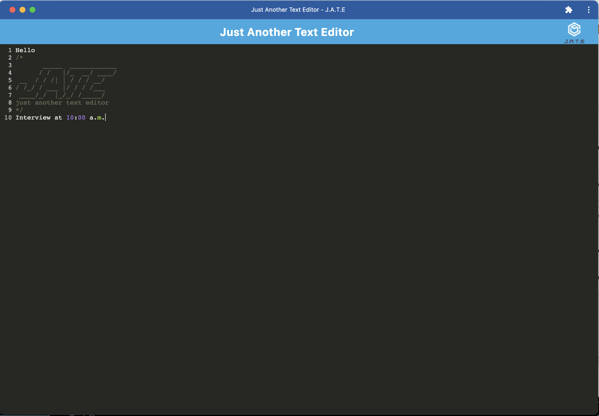

<h1>PWA-textEditor</h1>

## Table of Contents

  * [Description](#description)
  
  * [Installation](#installation)

  * [Preview](#preview)

  * [Links](#links)

  * [Questions](#questions)

## Description

- My motivation was to create a PWA text editor so that a user could take notes, update them, and delete them as needed.
- I built this project to learn how to create a functioning PWA and learn more about caching.
- Learned how to build a PWA.

## Installation

- Clone code from GitHub repository:
- Open in VS Code and command-line terminal.
- Type npm i, npm run build, and npm run start:dev to start localhost: 3000.
- From the browser install app by clicking icon in URL or by pressing install button. 
- Without localhost, the previous step can be done from heroku url.
- App will install and open on it own.

## Preview   
 

## Links

- GitHub: https://github.com/Caliza/PWA-textEditor
- Heroku: https://stark-bayou-41796.herokuapp.com/

## Questions

- For any additional questions on usage of application, please contact at rances.rodriguez@gmail.com.
